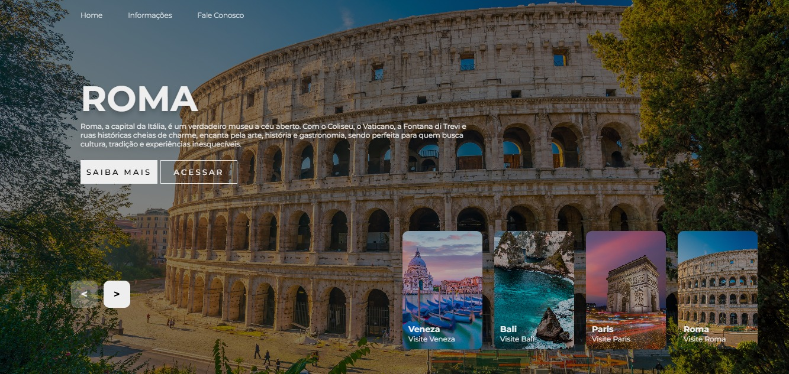

# 🌍 Carrossel de Imagens – Destinos Turísticos

Projeto Front-End de um carrossel interativo de imagens, onde o usuário pode navegar entre diferentes destinos turísticos utilizando setas de navegação, visualizando imagens e informações sobre cada local.

## 🖥️ Demonstração
🔗 Site online: https://slider-kappa-rosy.vercel.app/  
🔗 Repositório: https://github.com/mellacer/Slider

## 📸 Preview


## 🛠️ Tecnologias Utilizadas
- HTML5
- CSS3
- JavaScript

## ⚙️ Funcionalidades
- Navegação entre imagens através das setas de navegação
- Exibição de informações sobre cada local
- Animações suaves na transição entre os slides
- Miniaturas (thumbnails) dos destinos
- Layout moderno e visualmente atrativo

## 📚 Objetivo do Projeto
Este projeto foi desenvolvido com fins educacionais, com o objetivo de praticar:
- Manipulação do DOM com JavaScript
- Controle de estados de um carrossel
- Animações e transições com CSS
- Organização de layout com posicionamento e responsividade
- Integração entre HTML, CSS e JavaScript

## 📱 Responsividade
O layout foi adaptado para diferentes tamanhos de tela, ocultando elementos como miniaturas em telas menores e ajustando a navegação para mobile.

## 🚀 Como executar o projeto
```bash
# Clone o repositório
git clone https://github.com/mellacer/Slider

# Acesse a pasta do projeto
cd Slider

# Abra o arquivo index.html no navegador
